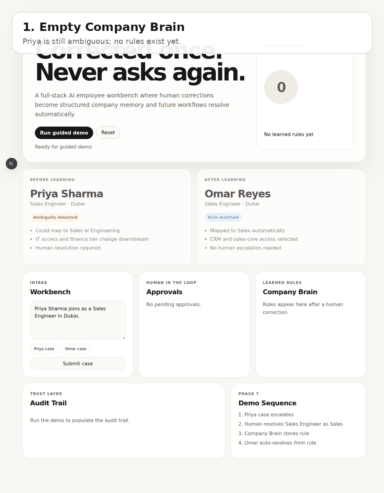
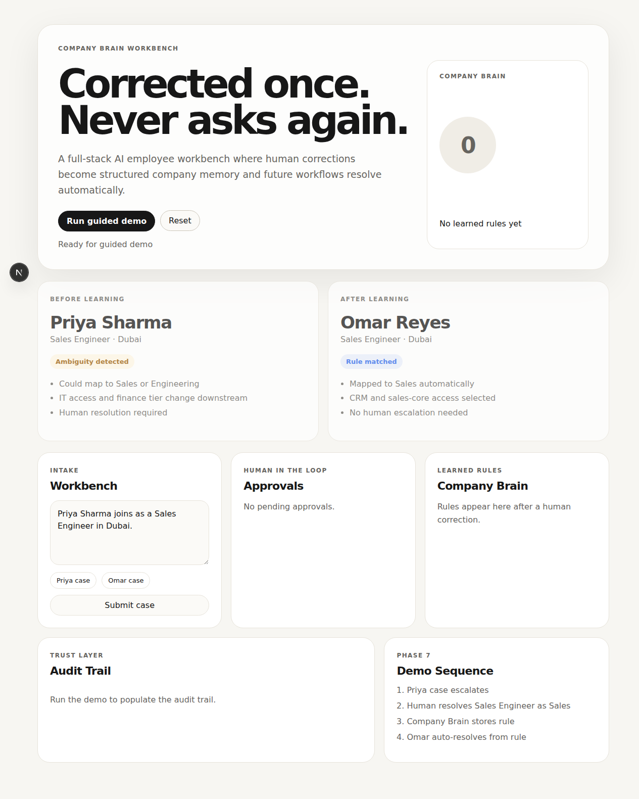
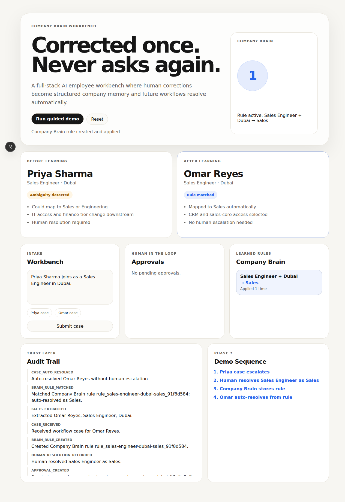

<div align="center">

# 🧠 Company Brain Workbench

### Full-stack AI employee memory layer

<br>

[](https://nextjs.org)
[](https://fastapi.tiangolo.com)
[](https://python.org)
[](https://typescriptlang.org)
[](./LICENSE)

<br>

*When a human resolves an ambiguity once, the system turns that judgment into reusable company memory.*
*The next AI employee does not ask again.*

<br>

</div>

---

> **The bottleneck in AI employees is not task execution.**  
> It is judgment reuse — turning one human decision into a durable rule the whole organization can apply.

Company Brain Workbench is a full-stack product prototype for human-in-the-loop AI operations: ambiguous cases route to a human once, the correction becomes structured memory, and future matching work resolves automatically.

<p align="center">
  
</p>

<br>

## ⚡ The Demo in 60 Seconds

<table>
<tr>
<td width="60" align="center"><h3>1</h3></td>
<td>
<b>Priya Sharma joins as a Sales Engineer in Dubai.</b><br>
The workbench extracts the case, detects that “Sales Engineer” can map to Sales or Engineering, and stops instead of guessing.
</td>
</tr>
<tr>
<td align="center"><h3>2</h3></td>
<td>
<b>A human resolves the ambiguity: Sales Engineer = Sales.</b><br>
The decision creates a Company Brain rule with downstream impact: CRM access, sales-core group, and sales-field finance tier.
</td>
</tr>
<tr>
<td align="center"><h3>3</h3></td>
<td>
<b>Omar Reyes joins as a Sales Engineer in Dubai.</b><br>
The Company Brain rule fires automatically. Omar resolves to Sales with no human escalation.
</td>
</tr>
</table>

**Corrected once. Never asks again.**

<br>

## 🖼 Product Screens

| Empty brain | Rule learned and applied |
|:---:|:---:|
|  |  |

<br>

## 🚀 Run

### Backend

```bash
cd backend
python3 -m venv .venv
source .venv/bin/activate
pip install -r requirements.txt
PYTHONPATH=. uvicorn app.main:app --reload --host 127.0.0.1 --port 8000
```

Backend docs:

```text
http://127.0.0.1:8000/docs
```

### Frontend

In a second terminal:

```bash
cd frontend
npm install
NEXT_PUBLIC_API_BASE=http://127.0.0.1:8000 npm run dev
```

Open:

```text
http://localhost:3000
```

<br>

## 🏗 Architecture

```text
├── backend/
│   ├── app/main.py                    FastAPI app · local CORS · API routes
│   ├── app/company_brain/
│   │   ├── engine.py                  Intake, ambiguity detection, rule matching
│   │   ├── schemas.py                 Pydantic request/state models
│   │   └── store.py                   Atomic JSON state persistence
│   ├── tests/test_company_brain.py    Priya → rule → Omar regression test
│   └── data/.gitkeep                  Runtime state directory · JSON ignored
│
├── frontend/
│   ├── app/page.tsx                   Product shell and guided demo UI
│   ├── app/styles.css                 Restrained internal-tool design system
│   └── lib/api.ts                     Typed frontend API client
│
├── assets/
│   ├── company-brain-workbench-demo.gif
│   ├── company-brain-workbench-initial.png
│   └── company-brain-workbench-completed.png
│
└── .github/workflows/ci.yml           Backend tests + frontend build
```

<br>

## 🎯 Design Decisions

| Decision | Why |
|:---|:---|
| **Ambiguity is a first-class product state** | The system should not hide uncertainty behind confident language. It should expose the decision and its downstream impact. |
| **Human correction becomes structured memory** | A resolution is not just an answer; it becomes a reusable rule with pattern, decision, source case, and application count. |
| **The hero flow is deterministic** | Priya always escalates first; Omar only auto-resolves after the rule exists. The demo is reliable for walkthroughs and recording. |
| **Audit trail is visible by default** | Enterprise trust comes from proving what happened: case received, ambiguity detected, approval created, rule created, rule matched. |
| **One accent color marks learning** | The interface stays calm; blue is reserved for the moments where company memory is created or applied. |

<br>

## 🔐 Security Posture

This is a local product prototype, not a production deployment.

| Safeguard | Status |
|:---|:---|
| `.env` files ignored | ✅ |
| Runtime JSON state ignored | ✅ |
| Local CORS origins only | ✅ |
| Input length validation | ✅ |
| Unsupported control-character rejection | ✅ |
| No raw HTML rendering of case data | ✅ |
| Dependency audit clean at push time | ✅ |
| GitHub Actions CI | ✅ |

See [`SECURITY.md`](./SECURITY.md) for production hardening notes.

<br>

## 🧪 API Surface

```text
POST /api/workflows/intake          Submit an employee/ops case
GET  /api/approvals                 List human-resolution items
POST /api/approvals/{id}/resolve    Turn a human answer into a rule
GET  /api/brain/rules               Inspect learned Company Brain rules
GET  /api/audit                     Review the decision trail
POST /api/demo/reset                Reset local demo state
POST /api/demo/run                  Execute Priya → Omar guided demo
```

<br>

## 🧬 Related Demo

This workbench expands the original focused thesis demo:

**[AI Employee Console](https://github.com/Karunasagar12/ai-employee-console)** — a lightweight product demo built around the same “corrected once, never asks again” idea.

<br>

## 💡 The Company Brain Thesis

Every time a human resolves an ambiguity an AI employee could not handle, that judgment should become structured memory: what happened, what context mattered, what was decided, and when it should apply again.

Over time, this layer compounds. Each correction eliminates a future escalation. Each deployment makes the next one smarter.

> **The moat is not one AI agent — it is the accumulated decision intelligence of the organization.**

<br>

---

<div align="center">

Built by **[Karuna Sagar](https://github.com/Karunasagar12)**

Founder, Plato Tech — clinical & document AI agents shipped to hospitals

</div>
